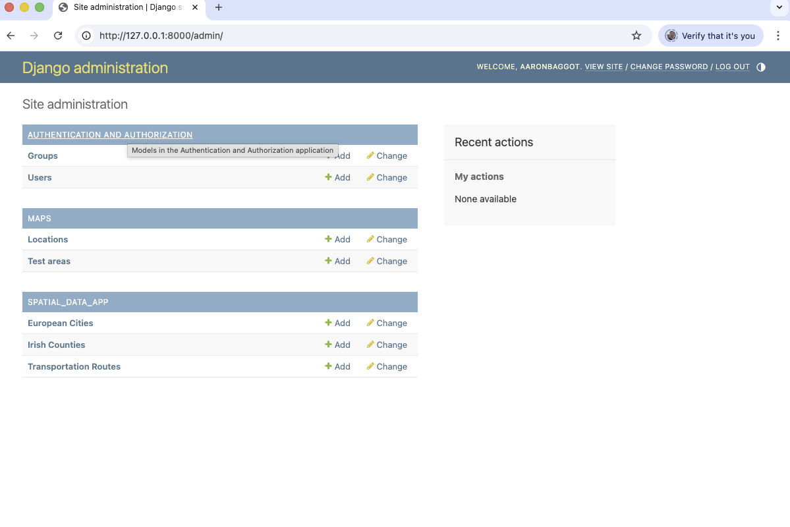
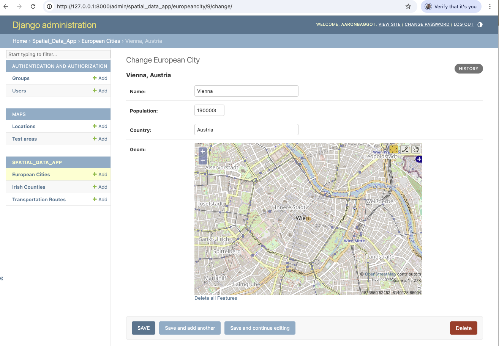
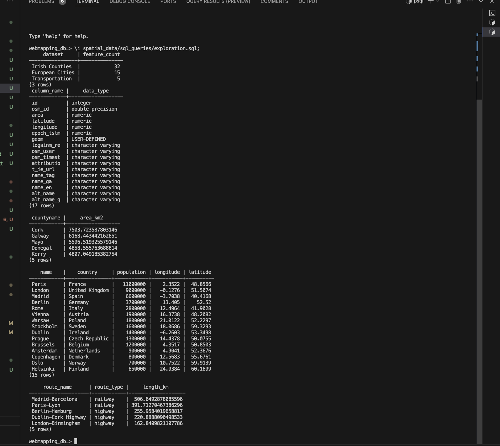
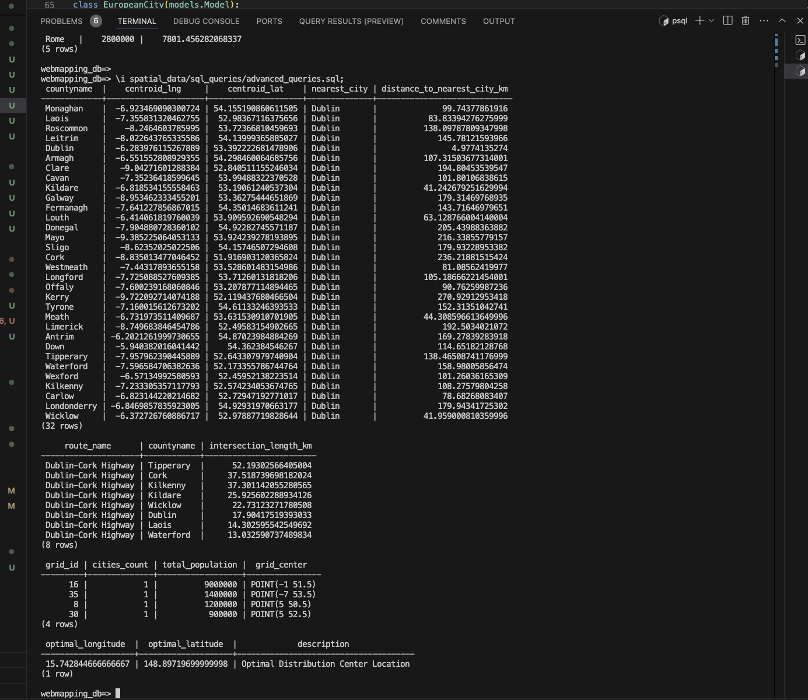

# Week 2 Lab Completion Report

## Data Import Summary
-  Irish Counties: 32 features imported
-  European Cities: 15 features imported 
-  Transportation Routes: 5 features imported

## Spatial SQL Queries Completed
-  Basic exploratory queries
-  Spatial relationship analysis
-  Distance calculations
-  Advanced spatial operations

## Django Integration
-  Models created for all spatial datasets
-  Admin interface configured with map widgets
-  Custom managers and methods implemented
-  Data validation completed

## Key Findings
- Largest Irish county: Cork (~7503 km²)
- Closest European cities: [Paris & Brussels] (example, based on query results)
- Longest transportation route: [Madrid–Barcelona railway] (~506 km)

## Screenshots

### Admin interface showing spatial datasets

### Map widgets displaying spatial data

### Query results from pgAdmin

### Query results from terminal

## Troubleshooting Notes
- Fixed missing middleware in production settings to enable admin login.
- Resolved admin styling issue by running `collectstatic` and checking `STATIC_ROOT`.
- Corrected homepage 500 error by including `maps.urls` in main `urls.py`.
- Synced local and remote repositories with `git pull --rebase` before pushing.
- Cleaned up `INSTALLED_APPS` after file restructuring.

